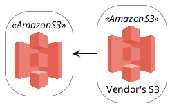
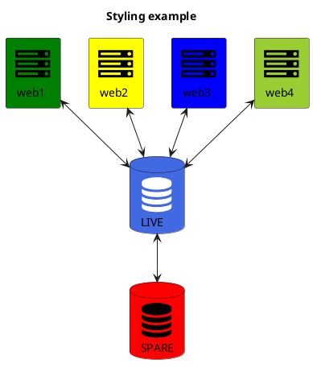
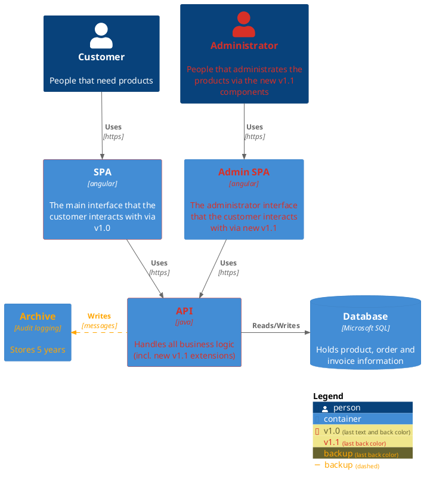
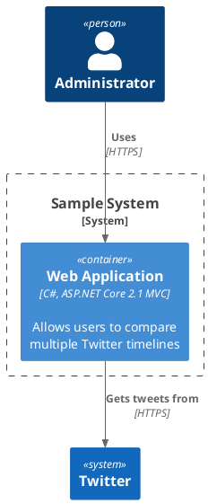
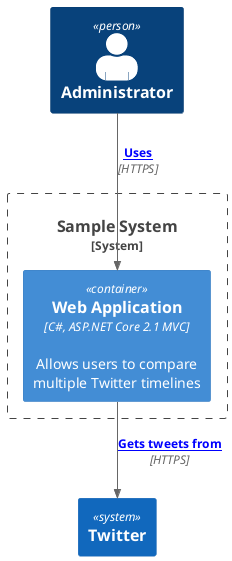

```plantuml
@startuml
!include <azure/AzureCommon>
!include <azure/Analytics/AzureEventHub>
!include <azure/Analytics/AzureStreamAnalytics>
!include <azure/Databases/AzureCosmosDb>

left to right direction

agent "Device Simulator" as devices #fff

AzureEventHub(fareDataEventHub, "Fare Data", "PK: Medallion HackLicense VendorId; 3 TUs")
AzureEventHub(tripDataEventHub, "Trip Data", "PK: Medallion HackLicense VendorId; 3 TUs")
AzureStreamAnalytics(streamAnalytics, "Stream Processing", "6 SUs")
AzureCosmosDb(outputCosmosDb, "Output Database", "1,000 RUs")

devices --> fareDataEventHub
devices --> tripDataEventHub
fareDataEventHub --> streamAnalytics
tripDataEventHub --> streamAnalytics
streamAnalytics --> outputCosmosDb
@enduml
```





